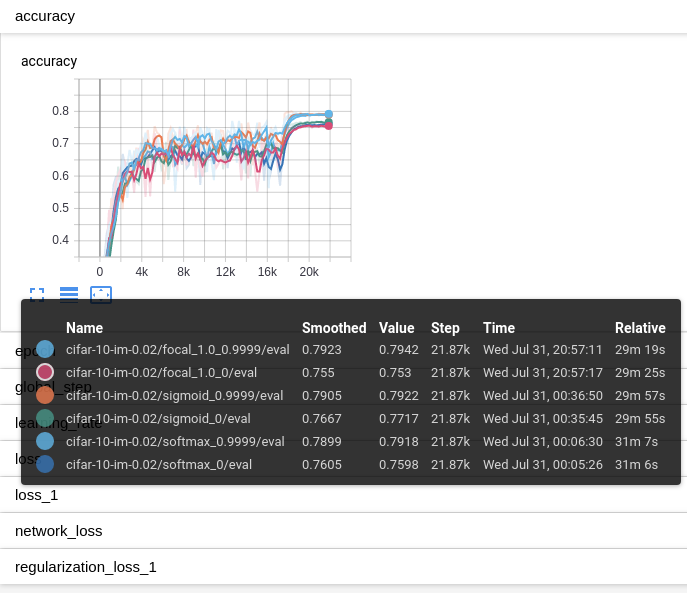

# Class-Balanced Loss Based on Effective Number of Samples

Tensorflow code for the paper:

[*Class-Balanced Loss Based on Effective Number of Samples*](https://arxiv.org/abs/1901.05555)\
[Yin Cui](https://ycui.me/), Menglin Jia, [Tsung-Yi Lin](https://vision.cornell.edu/se3/people/tsung-yi-lin/), [Yang Song](https://ai.google/research/people/author38270), [Serge Belongie](http://blogs.cornell.edu/techfaculty/serge-belongie/)


## Dependencies:
+ Python (3.6)
+ Tensorflow (1.14)


## Datasets:
+ Long-Tailed [CIFAR](https://www.cs.toronto.edu/~kriz/cifar.html).
We provide [a download link](https://drive.google.com/file/d/1NY3lWYRfsTWfsjFPxJUlPumy-WFeD7zK/) that includes all the data used in our paper in .tfrecords format. The data was converted and generated by `src/generate_cifar_tfrecords.py` (original CIFAR) and `src/generate_cifar_tfrecords_im.py` (long-tailed CIFAR).


## Effective Number of Samples:
For a visualization of the data and effective number of samples, please take a look at `data.ipynb`.


## Key Implementation Details:
+ [Weights for class-balanced loss](https://github.com/richardaecn/class-balanced-loss/blob/master/src/cifar_main.py#L425-L430)
+ [Focal loss](https://github.com/richardaecn/class-balanced-loss/blob/master/src/cifar_main.py#L226-L266)
+ [Assigning weights to different loss](https://github.com/richardaecn/class-balanced-loss/blob/master/src/cifar_main.py#L325-L354)
+ [Initialization of the last layer](https://github.com/richardaecn/class-balanced-loss/blob/master/src/model_base.py#L196)


## Training and Evaluation:
We provide 3 .sh scripts for training and evaluation.
+ On original CIFAR dataset:
```
./cifar_trainval.sh
```
+ On long-tailed CIFAR dataset (the hyperparameter `IM_FACTOR` is the inverse of "Imbalance Factor" in the paper):
```
./cifar_im_trainval.sh
```
+ On long-tailed CIFAR dataset using the proposed class-balanced loss (set non-zero `BETA`):
```
./cifar_im_trainval_cb.sh
```

+ Run Tensorboard for visualization:
```
tensorboard --logdir=./results --port=6006
```

+ The figure below are the results of running ```./cifar_im_trainval.sh``` and ```./cifar_im_trainval_cb.sh```:
<p float="left">
    
</p>


## Training with TPU:
We train networks on iNaturalist and ImageNet datasets using [Google's Cloud TPU](https://cloud.google.com/tpu/). The code for this section is in `tpu/`. Our code is based on the official implementation of [Training ResNet on Cloud TPU](https://cloud.google.com/tpu/docs/tutorials/resnet) and forked from https://github.com/tensorflow/tpu.


Data Preparation:
+ Download datasets (except images) from [this link](https://drive.google.com/file/d/1ZHhMFJxsgXItJYKiM_VJ0lznj8XClgWF/) and unzip it under `tpu/`. The unzipped directory `tpu/raw_data/` contains the training and validation splits. For raw images, please download from the following links and put them into the corresponding folders in `tpu/raw_data/`:
  + [iNaturalist 2017](https://github.com/visipedia/inat_comp/tree/master/2017)
  + [iNaturalist 2018](https://github.com/visipedia/inat_comp)
  + [ImageNet (ILSVRC2012)](http://www.image-net.org/challenges/LSVRC/2012/)

+ Convert datasets into .tfrecords format and upload to Google Cloud Storage (gcs) using `tpu/tools/datasets/dataset_to_gcs.py`:
```
python dataset_to_gcs.py \
  --project=$PROJECT \
  --gcs_output_path=$GCS_DATA_DIR \
  --local_scratch_dir=$LOCAL_TFRECORD_DIR \
  --raw_data_dir=$LOCAL_RAWDATA_DIR
```

The following 3 .sh scripts in `tpu/` can be used to train and evaluate models on iNaturalist and ImageNet using Cloud TPU. For more details on how to use Cloud TPU, please refer to [Training ResNet on Cloud TPU](https://cloud.google.com/tpu/docs/tutorials/resnet).

Note that the [image mean and standard deviation](https://github.com/richardaecn/class-balanced-loss/blob/master/tpu/models/official/resnet/resnet_main.py#L232-L238) and [input size](https://github.com/richardaecn/class-balanced-loss/blob/master/tpu/models/official/resnet/resnet_preprocessing.py#L22-L27) need to be updated accordingly.

+ On ImageNet (ILSVRC 2012):
```
./run_ILSVRC2012.sh
```
+ On iNaturalist 2017:
```
./run_inat2017.sh
```
+ On iNaturalist 2018:
```
./run_inat2018.sh
```

+ The pre-trained models, including all logs viewable on tensorboard, can be downloaded from the following links:

| Dataset          | Network   | Loss                      | Input Size | Download Link |
|------------------|-----------|---------------------------|------------|---------------|
| ILSVRC 2012      | ResNet-50 | Class-Balanced Focal Loss | 224        | [link](https://drive.google.com/file/d/1SmLv1-D1143Cma4Y5bDxHUfXjOI_0Yvr/) |
| iNaturalist 2018 | ResNet-50 | Class-Balanced Focal Loss | 224        | [link](https://drive.google.com/file/d/1aNyYCfAUXP4up_hvOhAKQkBevc2e8lr8/) |


## Citation
If you find our work helpful in your research, please cite it as:
```latex
@inproceedings{cui2019classbalancedloss,
  title={Class-Balanced Loss Based on Effective Number of Samples},
  author={Cui, Yin and Jia, Menglin and Lin, Tsung-Yi and Song, Yang and Belongie, Serge},
  booktitle={CVPR},
  year={2019}
}
```
